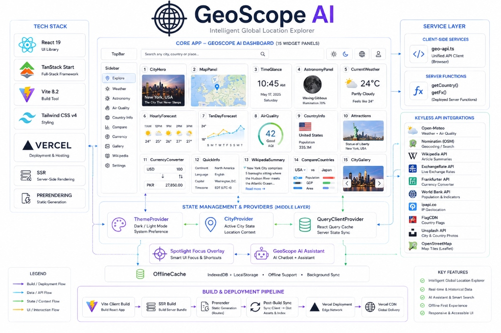
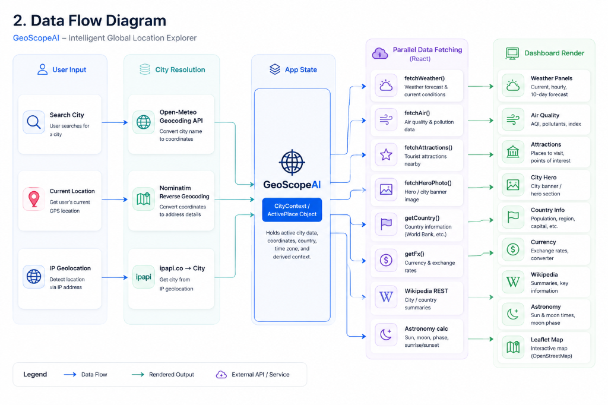
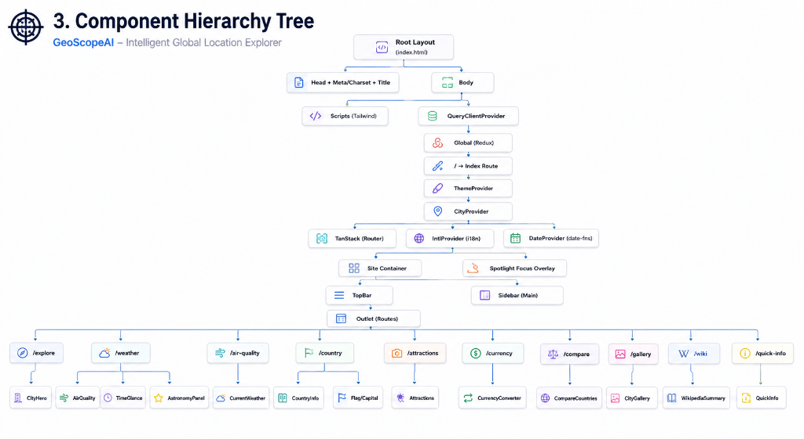
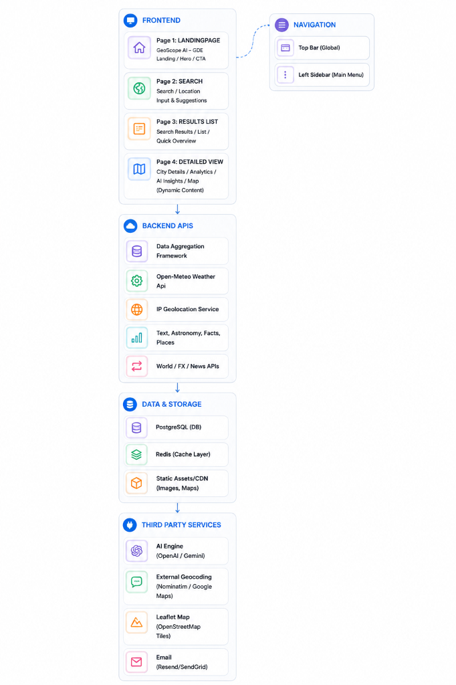
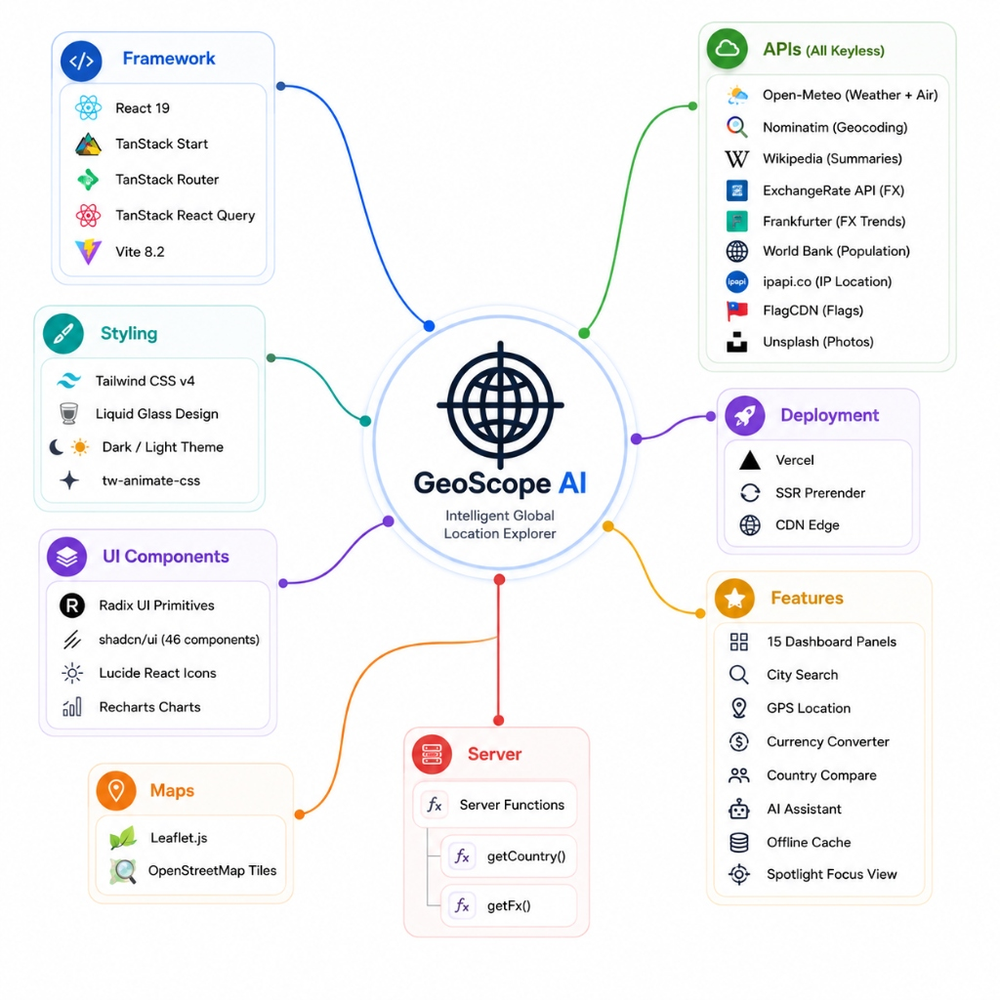

<p align="center">
  
</p>

<p align="center">
  <strong>Explore any city on Earth with live weather, air quality, maps, astronomy, currency rates, travel insights, and country intelligence — all in one stunning liquid-glass dashboard.</strong>
</p>

<p align="center">
  <a href="https://geoscopeai.vercel.app"></a>
  
  
  
  
  
</p>

<p align="center">
  
  
  
  
</p>

---

## Table of Contents

- [Overview](#-overview)
- [System Architecture](#-system-architecture)
- [Data Flow](#-data-flow)
- [Component Hierarchy](#-component-hierarchy)
- [Build & Deployment Pipeline](#-build--deployment-pipeline)
- [Features](#-features)
- [Tech Stack](#-tech-stack)
- [Project Structure](#-project-structure)
- [Getting Started](#-getting-started)
- [Contributing](#-contributing)
- [Author](#-author)
- [License](#-license)

---

## 🔭 Overview

**GeoScope AI** is a full-stack, server-side rendered web application that transforms any city or country query into a rich, interactive dashboard. Built with **React 19**, **TanStack Start**, and **Tailwind CSS v4**, it features a stunning **Apple-inspired liquid-glass UI** with 15 real-time data widgets — all powered by **keyless public APIs** requiring zero configuration.

### Key Highlights

| Feature | Description |
|:--------|:------------|
| **15 Dashboard Panels** | Weather, air quality, maps, astronomy, country info, attractions, currency, Wikipedia, gallery & more |
| **Liquid Glass Design** | Glassmorphism, backdrop blur, smooth animations inspired by Apple iOS 26 |
| **Dark & Light Mode** | Instant theme switching with `localStorage` persistence and zero-flash SSR |
| **SSR + Prerendering** | TanStack Start generates fully styled HTML at build time — instant first paint |
| **GPS + IP Detection** | Automatic city detection via browser geolocation or IP-based fallback |
| **Spotlight Focus** | Click any sidebar item to view a full-screen focused version of any panel |
| **AI Assistant** | Built-in GeoScope AI chatbot for location queries |
| **Offline Cache** | Service worker + IndexedDB for offline-first experience |
| **Fully Responsive** | Optimized layouts for mobile, tablet, and desktop |

---

## 🏗️ System Architecture

The complete system architecture showing all layers — from the browser client through Vercel Edge to external API integrations.

<p align="center">
  
</p>

<details>
<summary><strong>Architecture Layers Explained</strong></summary>

### Frontend (Browser)
The client-side React application renders a single-page dashboard with 15 widget panels. Initial HTML is prerendered at build time by TanStack Start for instant first paint.

### Service Layer
- **`geo-api.ts`** — Unified client-side API client handling all external data fetching with error boundaries and fallback chains
- **`astro.ts`** — Pure astronomical calculations (sunrise, sunset, moon phase) computed locally without external API calls

### Server Functions
- **`getCountry(code)`** — Resolves country codes to full country data (population, area, languages, driving side, etc.) using `world-countries` NPM package + World Bank API
- **`getFx(base, target)`** — Fetches live exchange rates and 30-day trend data from ExchangeRate API + Frankfurter API

### State Management
| Provider | Purpose |
|:---------|:--------|
| `ThemeProvider` | Dark/Light mode toggle with `localStorage` persistence |
| `CityProvider` | Active city state (coordinates, country, timezone) shared across all panels |
| `QueryClientProvider` | React Query cache for data fetching, caching, and background refetching |

### External APIs
All 11 external API integrations are **keyless** — no `.env` configuration required.

</details>

---

## 🔄 Data Flow

How user input flows through city resolution, parallel data fetching, and dashboard rendering.

<p align="center">
  
</p>

<details>
<summary><strong>Data Flow Explained</strong></summary>

### 1. User Input (3 Entry Points)
| Method | Description | API Used |
|:-------|:------------|:---------|
| **Search City** | User types a city name in the search bar | Open-Meteo Geocoding |
| **Current Location** | Browser GPS coordinates | Nominatim Reverse Geocoding |
| **IP Geolocation** | Automatic fallback when GPS is unavailable | ipapi.co |

### 2. City Resolution
All three input methods resolve to a **`Place`** object containing `name`, `latitude`, `longitude`, `country`, `countryCode`, and `timezone`.

### 3. CityContext State
The resolved `Place` object is stored in `CityProvider` React Context, triggering all subscribed panels to re-fetch data.

### 4. Parallel Data Fetching
React Query fires **8 parallel requests** simultaneously:

| Function | API Source | Panel |
|:---------|:----------|:------|
| `fetchWeather()` | Open-Meteo | Weather, Hourly, 10-Day Forecast |
| `fetchAir()` | Open-Meteo Air Quality | Air Quality |
| `fetchAttractions()` | Wikipedia Search | Attractions |
| `fetchHeroPhoto()` | Unsplash / Curated Map | City Hero |
| `getCountry()` | World Bank + world-countries | Country Info |
| `getFx()` | ExchangeRate + Frankfurter | Currency Converter |
| Wikipedia REST | Wikipedia Summary API | Wikipedia Summary |
| Astronomy calc | Local computation | Astronomy Panel |

### 5. Dashboard Render
Each panel independently renders its data with loading skeletons, error states, and smooth transitions.

</details>

---

## 🌳 Component Hierarchy

The React component tree from the HTML root to all 15 dashboard panels.

<p align="center">
  
</p>

<details>
<summary><strong>Component Tree Explained</strong></summary>

```
html (lang="en")
├── head
│   ├── HeadContent (meta tags, favicon, stylesheet)
│   └── Inline Theme Script (localStorage → dark class, zero-flash)
└── body
    ├── QueryClientProvider (React Query)
    │   └── Outlet (TanStack Router)
    │       └── / → Index Route
    │           └── ThemeProvider
    │               └── CityProvider
    │                   ├── Toaster (Sonner notifications)
    │                   ├── main
    │                   │   └── Glass Container
    │                   │       ├── Sidebar (navigation)
    │                   │       └── Content Area
    │                   │           ├── TopBar (search + theme toggle)
    │                   │           ├── Row 1: CityHero | MapPanel | TimeGlance + AstronomyPanel
    │                   │           ├── Row 2: CurrentWeather | HourlyForecast | TenDayForecast
    │                   │           ├── Row 3: AirQuality | CountryInfo | Attractions
    │                   │           ├── Row 4: CurrencyConverter | QuickInfo | WikipediaSummary
    │                   │           ├── Row 5: CompareCountries | CityGallery
    │                   │           ├── StatusBar
    │                   │           └── OfflineCache
    │                   ├── Spotlight Focus Overlay (full-screen panel view)
    │                   └── GeoScopeAssistant (AI chatbot)
    └── Scripts (TanStack hydration)
```

### UI Component Library
The app uses **46 shadcn/ui components** built on top of **Radix UI** primitives:

`Accordion` · `Alert` · `Avatar` · `Badge` · `Button` · `Calendar` · `Card` · `Carousel` · `Chart` · `Checkbox` · `Command` · `Dialog` · `Drawer` · `Dropdown Menu` · `Form` · `Hover Card` · `Input` · `Label` · `Menubar` · `Navigation Menu` · `Pagination` · `Popover` · `Progress` · `Radio Group` · `Scroll Area` · `Select` · `Separator` · `Sheet` · `Sidebar` · `Skeleton` · `Slider` · `Switch` · `Table` · `Tabs` · `Textarea` · `Toggle` · `Tooltip` · and more

</details>

---

## 🚀 Build & Deployment Pipeline

The complete build process from source code to Vercel CDN edge delivery.

<p align="center">
  
</p>

<details>
<summary><strong>Build Pipeline Explained</strong></summary>

### Build Phases (Sequential)

```
npm run build
    │
    ▼
┌─────────────────────────────────────┐
│  Phase 1: Vite Client Build        │
│  • 1917 modules transformed        │
│  • Output: dist/client/assets/     │
│  • styles-*.css (120KB Tailwind)   │
│  • *.js chunks (React app)         │
│  • closeBundle() fires (#1)        │
└─────────────────┬───────────────────┘
                  ▼
┌─────────────────────────────────────┐
│  Phase 2: SSR Build                │
│  • 75 modules transformed          │
│  • Output: dist/server/            │
│  • server.js (SSR entry)           │
│  • closeBundle() fires (#2)        │
└─────────────────┬───────────────────┘
                  ▼
┌─────────────────────────────────────┐
│  Phase 3: Prerender                │
│  • Crawls "/" route                │
│  • Generates full HTML with        │
│    inline styles + data            │
│  • Output: dist/client/index.html  │
└─────────────────┬───────────────────┘
                  ▼
┌─────────────────────────────────────┐
│  Phase 4: Post-Build Sync Plugin   │
│  • Polls for prerendered HTML      │
│  • Copies dist/client → dist/     │
│  • Syncs index.html               │
│  • process.exit(0)                │
└─────────────────┬───────────────────┘
                  ▼
┌─────────────────────────────────────┐
│  Vercel Deployment                  │
│  • Detects dist/ output            │
│  • Uploads to CDN edge             │
│  • SPA rewrite: /* → index.html   │
│  • Global delivery (< 50ms TTFB)  │
└─────────────────────────────────────┘
```

### Browser Load Sequence
1. **Request `/`** → Vercel CDN serves prerendered `index.html`
2. **CSS loads** → `styles-*.css` (Tailwind + design tokens) — styled on first frame
3. **JS loads** → React bundles download in parallel
4. **Hydration** → React attaches event listeners to existing DOM
5. **Interactive** → Full SPA experience with client-side navigation

</details>

---

## ✨ Features

### 15 Dashboard Panels

| # | Panel | Description | Data Source |
|:--|:------|:------------|:-----------|
| 1 | **City Hero** | Full-width city photo with name overlay | Unsplash / Curated Photos |
| 2 | **Map Panel** | Interactive Leaflet map with markers | OpenStreetMap Tiles |
| 3 | **Time Glance** | Local time, date, timezone | Computed from timezone |
| 4 | **Astronomy** | Sunrise, sunset, moon phase, illumination | Local computation |
| 5 | **Current Weather** | Temperature, feels like, conditions | Open-Meteo |
| 6 | **Hourly Forecast** | 24-hour temperature + conditions chart | Open-Meteo |
| 7 | **10-Day Forecast** | Extended forecast with min/max temps | Open-Meteo |
| 8 | **Air Quality** | AQI index, PM2.5, PM10, O₃, NO₂ | Open-Meteo Air Quality |
| 9 | **Country Info** | Flag, population, area, capital, languages | World Bank + world-countries |
| 10 | **Attractions** | Top tourist spots with photos + distances | Wikipedia Search |
| 11 | **Currency Converter** | Live exchange rates with 30-day trend chart | ExchangeRate + Frankfurter |
| 12 | **Quick Info** | Internet TLD, calling code, continent, driving side | world-countries |
| 13 | **Wikipedia Summary** | City article extract with read more link | Wikipedia REST API |
| 14 | **Compare Countries** | Side-by-side country statistics comparison | world-countries + World Bank |
| 15 | **City Gallery** | Photo grid with carousel navigation | Unsplash / Curated Photos |

### Additional Features

- 🎨 **Liquid Glass UI** — Apple iOS 26-inspired glassmorphism with backdrop blur, translucent panels, and smooth transitions
- 🌙 **Dark / Light Mode** — Instant toggle with zero-flash on page load (inline `<script>` reads `localStorage` before paint)
- 🔍 **Smart Search** — Fuzzy city search with autocomplete dropdown (Open-Meteo Geocoding)
- 📍 **GPS Detection** — Browser Geolocation API with reverse geocoding fallback chain (Nominatim → BigDataCloud → ipapi.co)
- 🔎 **Spotlight Focus** — Sidebar navigation opens any panel in a full-screen overlay with blur background
- 🤖 **AI Assistant** — Built-in GeoScope AI chatbot for natural language location queries
- 📱 **Fully Responsive** — Optimized grid layouts for mobile (1 col), tablet (2 col), and desktop (3 col)
- ⚡ **Offline Cache** — IndexedDB + localStorage for offline-first data persistence
- 🔔 **Toast Notifications** — Sonner toast system for user feedback

---

## 🛠️ Tech Stack

<p align="center">
  
</p>

### Core Framework

| Technology | Version | Purpose |
|:-----------|:--------|:--------|
| [React](https://react.dev) | 19 | UI rendering and component model |
| [TanStack Start](https://tanstack.com/start) | 1.168+ | Full-stack SSR framework with file-based routing |
| [TanStack Router](https://tanstack.com/router) | 1.170+ | Type-safe client-side routing |
| [TanStack React Query](https://tanstack.com/query) | 5.101+ | Data fetching, caching, and synchronization |
| [Vite](https://vite.dev) | 8.2 | Build tool, dev server, and HMR |
| [TypeScript](https://typescriptlang.org) | 5.7 | Static type checking |

### Styling & UI

| Technology | Purpose |
|:-----------|:--------|
| [Tailwind CSS v4](https://tailwindcss.com) | Utility-first CSS framework with `@tailwindcss/vite` plugin |
| [shadcn/ui](https://ui.shadcn.com) | 46 accessible, customizable UI components |
| [Radix UI](https://radix-ui.com) | Headless, accessible UI primitives |
| [Lucide React](https://lucide.dev) | Beautiful SVG icon library |
| [Recharts](https://recharts.org) | Data visualization (hourly forecast, currency trend charts) |
| [tw-animate-css](https://github.com/magicuidesign/tw-animate-css) | Tailwind animation utilities |

### Maps & Geospatial

| Technology | Purpose |
|:-----------|:--------|
| [Leaflet.js](https://leafletjs.com) | Interactive map rendering |
| [OpenStreetMap](https://openstreetmap.org) | Map tile provider |

### Deployment

| Technology | Purpose |
|:-----------|:--------|
| [Vercel](https://vercel.com) | Hosting, CDN, and deployment |
| SSR Prerendering | Build-time HTML generation for instant first paint |

---

## 📁 Project Structure

```
GeoScopeAI/
├── config/
│   └── vite.config.ts            # Vite 8 + TanStack Start + Tailwind + PostBuildSync plugin
├── docs/
│   └── architecture/             # Architecture diagrams
│       ├── geoscope-logo-transparent.png
│       ├── 01-system-architecture.jpg
│       ├── 02-data-flow-diagram.png
│       ├── 03-component-hierarchy-tree.png
│       ├── 04-build-deploy-pipeline.png
│       └── 05-tech-stack-mindmap.jpg
├── public/
│   ├── fonts/                    # Custom fonts
│   ├── images/                   # Static images (logos, icons, city photos)
│   ├── favicon.ico
│   └── robots.txt
├── scripts/
│   └── post-build.js             # Post-build file sync script
├── src/
│   ├── components/
│   │   ├── geoscope/             # App-specific components
│   │   │   ├── GeoScopeAssistant.tsx    # AI chatbot widget
│   │   │   ├── LeafletMap.tsx           # Interactive map (Leaflet)
│   │   │   ├── MapPanel.tsx             # Map container
│   │   │   ├── Sidebar.tsx              # Navigation sidebar
│   │   │   ├── TopBar.tsx               # Search bar + theme toggle + nav
│   │   │   ├── icons.tsx                # Custom SVG icons
│   │   │   ├── offline.tsx              # Offline cache manager
│   │   │   └── panels.tsx               # All 15 dashboard panels (122KB)
│   │   └── ui/                   # shadcn/ui components (46 files)
│   │       ├── button.tsx
│   │       ├── card.tsx
│   │       ├── chart.tsx
│   │       └── ... (46 total)
│   ├── context/
│   │   ├── city-context.tsx      # Active city state provider
│   │   └── theme-context.tsx     # Dark/Light theme provider
│   ├── data/
│   │   ├── country-facts.ts      # Continent mapping + driving side data
│   │   └── travel-facts.ts       # Curated attractions per city
│   ├── functions/
│   │   ├── country.functions.ts  # Server function: getCountry()
│   │   └── fx.functions.ts       # Server function: getFx()
│   ├── hooks/
│   │   └── use-mobile.tsx        # Responsive breakpoint hook
│   ├── lib/
│   ├── routes/
│   │   ├── __root.tsx            # Root layout (HTML shell, head, scripts)
│   │   └── index.tsx             # Main dashboard page
│   ├── server/
│   │   └── error-capture.ts      # Server-side error handling
│   ├── services/
│   │   ├── geo-api.ts            # All external API calls (37KB)
│   │   └── astro.ts              # Astronomy calculations
│   ├── utils/
│   │   ├── error-page.ts         # Error page rendering
│   │   ├── error-reporting.ts    # Error reporting utility
│   │   └── utils.ts              # General utilities (cn helper)
│   ├── router.tsx                # TanStack Router configuration
│   ├── server.ts                 # Server entry point
│   ├── start.ts                  # TanStack Start entry
│   └── styles.css                # Global styles + Tailwind config + design tokens (23KB)
├── vercel.json                   # Vercel deployment configuration
├── package.json
├── tsconfig.json
└── README.md
```

---

## 🚀 Getting Started

### Prerequisites

- **Node.js** 18+ (recommended: 20+)
- **npm** 9+ (included with Node.js)

### Installation

```bash
# Clone the repository
git clone https://github.com/musama-dev/GeoScopeAI.git
cd GeoScopeAI

# Install dependencies
npm install --legacy-peer-deps

# Start development server
npm run dev
```

The app will be available at **`http://localhost:5173`**.

### Available Scripts

| Command | Description |
|:--------|:------------|
| `npm run dev` | Start Vite dev server with HMR |
| `npm run build` | Production build (client + SSR + prerender) |
| `npm run preview` | Preview production build locally |
| `npm run build:dev` | Development mode build for debugging |

---

## 🤝 Contributing

Contributions are welcome! Here's how to get started:

1. **Fork** the repository
2. **Create** a feature branch (`git checkout -b feature/amazing-feature`)
3. **Commit** your changes (`git commit -m 'Add amazing feature'`)
4. **Push** to the branch (`git push origin feature/amazing-feature`)
5. **Open** a Pull Request


---

## 👤 Author

**Muhammad Usama**

- GitHub: [@musama-dev](https://github.com/musama-dev)

---

## 📄 License

This project is licensed under the **MIT License** — see the [LICENSE](LICENSE) file for details.

---

<p align="center">
  
  <br />
  <sub>© Made by Muhammad Usama</sub>
</p>
